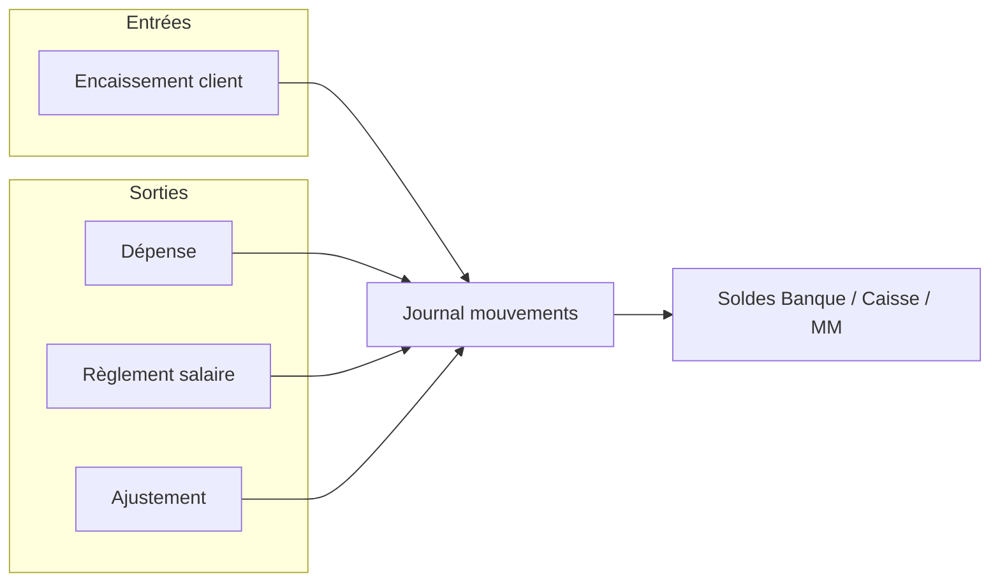

# Workflow — Module Trésorerie

Voici le workflow ajouté avec le module **Trésorerie**.

Décisions structurantes : [docs/adr/](adr/README.md) (ADR-0001 à ADR-0007).

---

## Idée générale

On ne fait pas de comptabilité légale. On suit l’**argent réel** de l’entreprise via :

1. des **comptes** (Banque, Caisse, Mobile Money)
2. un **journal de mouvements** (entrées / sorties)
3. le **solde** = solde d’ouverture + entrées − sorties

---

## 0. Paramétrage (`/parametres`)

Avant d’utiliser les flux, on paramètre les référentiels (permission `grades.manage`) :

| Onglet | Rôle |
|--------|------|
| **Catégories** | Catégories de dépense (loyer, carburant, etc.) |
| **Comptes** | Comptes Banque / Caisse / Mobile Money + solde d’ouverture |
| **Modes** | Modes de paiement (espèces, virement, Mobile Money, etc.) |

Les formulaires (dépenses, paie, encaissements, ajustements) consomment ces listes actives.

---

## 1. Dépenses (`/tresorerie/depenses`)

1. RH/admin saisit une dépense (catégorie, libellé, montant, date, **compte**, mode).
2. Le système crée la dépense **et** un mouvement **sortie** sur le compte choisi.
3. Le solde du compte baisse tout de suite.

Annuler une dépense → mouvement inverse + dépense soft-deleted.

---

## 2. Paie (`/rh/paie`)

Le calcul salarial (brut, CNPS, IGR, net) **ne change pas** à la génération (base contrat).

Ce qui change : **Marquer payé** demande maintenant, pour chaque agent / rondier :

- **salaire perçu ce mois** (obligatoire — ajustable selon jours travaillés)
- moyen de paiement
- compte débité
- référence optionnelle

Puis, en une transaction :

1. bulletin → statut `paye` + salaire_net (perçu) + date + mode + compte
2. mouvement **sortie** = montant perçu sur ce compte

Valider la période passe aussi les bulletins brouillon → `valide`.

Règlement **groupé** : cocher des lignes → **Marquer payé (N)**, ou **Régler tous les non payés** (toute la période, hors pagination) — même mode/compte, salaire perçu par agent.

Les stats Trésorerie montrent la masse salariale **payée** du mois, par mode et par compte.

---

## 3. Encaissements clients (`/paiements`)

Un paiement facture reste un encaissement commercial.

En plus, à la création :

1. on choisit le **compte** qui reçoit l’argent
2. un mouvement **entrée** est posté sur ce compte

Modification / suppression → annulation (mouvement inverse) puis éventuel nouveau mouvement.

---

## 4. Vue Trésorerie (`/tresorerie`)

- solde par compte + solde consolidé
- journal des mouvements
- dépenses du mois
- salaires payés du mois
- ajustement manuel (entrée/sortie hors facture/paie/dépense)

---

## Ce qui ne se mélange pas

| Domaine | Rôle |
|--------|------|
| **Commercial** | Factures, créances (`/recouvrement`), qui a payé quoi |
| **RH / Paie** | Qui gagne quoi, bulletins |
| **Trésorerie** | Où est l’argent, entrées/sorties, soldes |

Même cashbook, trois portes d’entrée : dépense, salaire, encaissement client.

Le **recouvrement** reste Commercial jusqu’à l’encaissement ; Trésorerie ne voit que le cash une fois le paiement enregistré.

---

## Feature flag & droits

| Élément | Valeur |
|---------|--------|
| Feature flag | `module.tresorerie` |
| Permissions | `tresorerie.view` / `tresorerie.manage`, `depenses.view` / `depenses.manage` |
| Paramètres référentiels | `grades.manage` (ou `tresorerie.manage`) |
